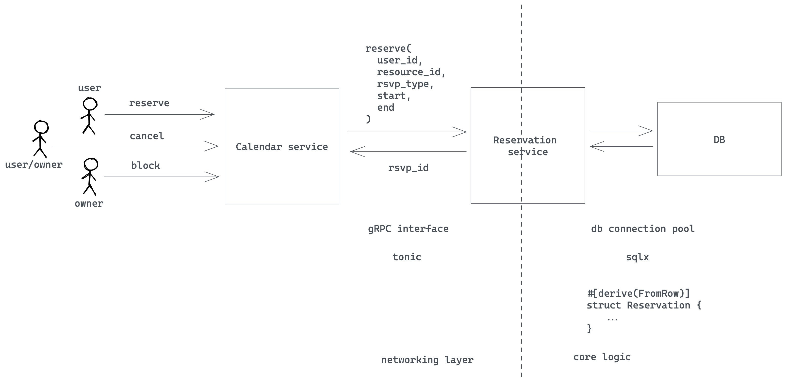

# Core reservation service

- Feature Name: core-reservation
- Start Date: 2022-11-21 11:08:19

## Summary

A core reservation service that solves the problem of reserving a resource for a period of time.
We leverage prostgres EXCLUDE constraint to ensure that only one reservation can be made for a given resource at a given time.

## Motivation

We need a common solution for various reservation requirements : 1) calendar booking, 2) hotel/room booking, 3) meeting room booking, 4) parking lot reservation, 5) resource reservation, 6) etc. Repeatedly building features for these requirements is a waste of time and resources. We should have a common solution that can be used for all these requirements.

## Guide-level explanation

### Service interface

Basic architecture of the service is as follows:



We would use gRpc as a service interface. The service interface would be as follows:

 ```proto
syntax = "proto3";

enum ReservationStatus {
  UNKNOWN = 0;
  PENDING = 1;
  CONFIRMED = 2;
  BLOCKED = 3;
}
enum ReservationUpdateType {
  UNKNOWN = 0;
  CREATE = 1;
  UPDATE = 2;
  DELETE = 3;
}

message Reservation {
    string id = 1;
    string user_id = 2;
    ReservationStatus status = 3;

    // The resource that is being reserved
    string resource_id = 4;
    google.protobuf.Timestamp start = 5;
    google.protobuf.Timestamp end = 6;
    // extra fields
    string note = 7;
}

message ReserveRequest {
    Reservation reservation = 1;
}
message ReserveResponse {
    Reservation reservation = 1;
}
message UpdateRequest {
    string note =2;
}
message UpdateResponse {
    Reservation reservation = 1;
}
message ConfirmRequest {
    string id = 1;
}
message ConfirmResponse {
    Reservation reservation = 1;
}
message CancelRequest {
    string id = 1;
}
message CancelResponse {
    Reservation reservation = 1;
}
message GetRequest {
    string id = 1;
}
message GetResponse {
    Reservation reservation = 1;
}
message QueryRequest {
    string resource_id = 1;
    string user_id = 2;
    // use status to filter result. If UNKNOWN, return all reservations
    ReservationStatus status = 3;
    google.protobuf.Timestamp start = 4;
    google.protobuf.Timestamp end = 5;
}
message ListenRequest {

}

message ListenResponse {
    Reservation reservation = 1;
}
service ReservationService {
    rpc reserve(ReserveRequest) returns (ReserveResponse);
    rpc confirm(ConfirmRequest) returns (ConfirmResponse);
    rpc update(UpdateRequest) returns ( UpdateResponse);
    rpc cancel(CancelRequest) returns (CancelResponse);
    rpc get(GetRequest) returns (GetResponse);
    rpc query(QueryRequest) returns (stream Reservation);
    // another system could monitor newly added/updated/cancelled/confirmed reservations
    rpc listen(ListenRequest) returns (ListenResponse);
}

 ```

### database schema

We would use postgres as the database. The schema would be as follows:

[the postgres document link](https://www.postgresql.org/docs/15/rangetypes.html)
[gist index link](https://www.postgresql.org/docs/15/indexes-types.html)
[trigger link](https://www.postgresql.org/docs/15/plpgsql-trigger.html)

```sql
create schema rsvp;
create type rsvp.reservation_status as enum ('unknown', 'pending', 'confirmed', 'blocked');
create type rsvp.reservation_update_type as enum ('unknown', 'create', 'update', 'delete');
CREATE TABLE rsvp.reservations (
    id uuid NOT NULL DEFAULT uuid_generate_v4(),
    user_id varchar(64) NOT NULL,
    status revp.reservation_status NOT NULL  DEFAULT 'pending',
    resource_id varchar(64) NOT NULL,
    timespan tstzrange NOT NULL,

    note text,
    CONSTRAINT reservations_pkey PRIMARY KEY (id),
);

CREATE INDEX reservation_resource_id_idx ON rsvp.reservations (resource_id);
CREATE INDEX reservation_user_id_idx ON rsvp.reservations (user_id);
-- if user_id is not provided, we can use this index to query all reservations for a given resource in a given during time range
-- if resource_id is not provided, we can use this index to query all reservations for a given user in a given during time range
-- if both resource_id and user_id are provided, we can use this index to query all reservations for a given resource and user in a given during time range
-- if neither resource_id nor user_id are provided, we can use this index to query all reservations in a given during time range
CREATE OR REPLACE FUNCTION rsvp.query(uid text, rid text,during: tstzrange ) RETURNS TABLE
rsvp.reservations AS $$ $$ LANGUAGE plpgsql;

-- reservation change queue
CREATE TABLE rsvp.reservation_changes (
    id SERIAL not null,
    reservation_id uuid NOT NULL,
    op rsvp.reservation_update_type NOT NULL ,
    CONSTRAINT reservation_changes_pkey PRIMARY KEY (id),
);

-- trigger for add/update/delete a reservation
CREATE OR REPLACE FUNCTION rsvp.reservation_trigger() RETURNS trigger AS $$
BEGIN
    IF (TG_OP = 'INSERT') THEN
        -- update reservation_changes table
        INSERT INTO rsvp.reservation_changes (reservation_id, op) VALUES (NEW.id, 'create');
        -- check if the reservation is valid
        -- check if the reservation is conflicting with other reservations
        -- if not, insert the reservation
        -- if yes, return error
    ELSIF (TG_OP = 'UPDATE') THEN
        -- if status is changed, update reservation_changes table
        IF (OLD.status != NEW.status) THEN
            INSERT INTO rsvp.reservation_changes (reservation_id, op) VALUES (NEW.id, 'update');
        END IF;

        -- check if the reservation is valid
        -- check if the reservation is conflicting with other reservations
        -- if not, update the reservation
        -- if yes, return error
    ELSIF (TG_OP = 'DELETE') THEN
        -- update reservation_changes table
        INSERT INTO rsvp.reservation_changes (reservation_id, op) VALUES (OLD.id, 'delete');

        -- delete the reservation
    END IF;
    -- notify a channel called reservation_change
    NOTIFY reservation_change , NEW.id;
    RETURN null;
END;
$$ LANGUAGE plpgsql;

CREATE TRIGGER reservation_trigger
    AFTER INSERT OR UPDATE OR DELETE ON rsvp.reservations
    FOR EACH ROW EXECUTE PROCEDURE rsvp.reservation_trigger();


```

Here we use Exclusion Constraint to provided by postgres to ensure that on overlapping
reservation cannot be created for a given resource at a given time range.

```sql
CONSTRAINT reservation_conflict  EXCLUDE USING gist (resource_id WITH =, timespan WITH &&)

```


We also use a trigger to notify a channel  when a reservation is created, updated or deleted.
To make sure even we missed certain messages from the channel when DB connection is down for some reason,we use a queue to store the reservation changes. Thus when we receive a notification , we can query the queue to get all the changes happened since the last time we checked.and once we finished processing the changes, we can delete them from the queue.

### Core flow


## Reference-level explanation

TBD

## Drawbacks

Why should we *not* do this?

## Rationale and alternatives

- Why is this design the best in the space of possible designs?
- What other designs have been considered and what is the rationale for not choosing them?
- What is the impact of not doing this?

## Prior art

Discuss prior art, both the good and the bad, in relation to this proposal.
A few examples of what this can include are:

- For language, library, cargo, tools, and compiler proposals: Does this feature exist in other programming languages and what experience have their community had?
- For community proposals: Is this done by some other community and what were their experiences with it?
- For other teams: What lessons can we learn from what other communities have done here?
- Papers: Are there any published papers or great posts that discuss this? If you have some relevant papers to refer to, this can serve as a more detailed theoretical background.

This section is intended to encourage you as an author to think about the lessons from other languages, provide readers of your RFC with a fuller picture.
If there is no prior art, that is fine - your ideas are interesting to us whether they are brand new or if it is an adaptation from other languages.

Note that while precedent set by other languages is some motivation, it does not on its own motivate an RFC.
Please also take into consideration that rust sometimes intentionally diverges from common language features.

## Unresolved questions

- how to handle repeated reservation requests? - is this a business logic which shouldn't be put into this layer?(non-goal: we cosider this as a business logic and should be handled by caller)

- if load is high, we may need to use a external queue to store the reservation changes. Thus when we receive a notification , we can query the queue to get all the changes happened since the last time we checked.and once we finished processing the changes, we can delete them from the queue.
- we haven't considered tracking/observability/deployment yet.
- query performance might be an issue - need to revisit the query index and also consider using cache.

## Future possibilities

Think about what the natural extension and evolution of your proposal would
be and how it would affect the language and project as a whole in a holistic
way. Try to use this section as a tool to more fully consider all possible
interactions with the project and language in your proposal.
Also consider how this all fits into the roadmap for the project
and of the relevant sub-team.

This is also a good place to "dump ideas", if they are out of scope for the
RFC you are writing but otherwise related.

If you have tried and cannot think of any future possibilities,
you may simply state that you cannot think of anything.

Note that having something written down in the future-possibilities section
is not a reason to accept the current or a future RFC; such notes should be
in the section on motivation or rationale in this or subsequent RFCs.
The section merely provides additional information.
